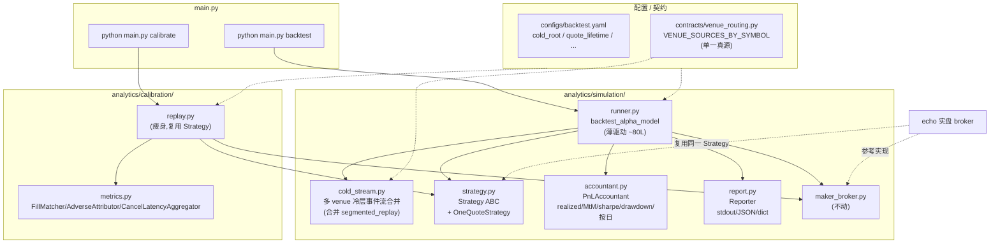

# BACKTEST_REFACTOR — 回测/校准重构设计

**对标:** `REFACTOR_DESIGN.md`(整体重构与主线裁决)。本文档承接其裁决 ——
**主线 = `simulation/` + `calibration/` + `features/realtime.py` + `core/contracts/recorder/`**
—— 在录制端 P0–P5 落地后,把同一节奏延伸到撮合外层(策略 / 账户 / 报告 / CLI)。

**范围:** `analytics/simulation/` + `analytics/calibration/` + `analytics/segmented_replay.py`
+ `main.py` 子命令 + `configs/backtest.yaml` + 对应 `tests/`。

**不动:** `MakerSimBroker` 撮合内核(P4 已稳固,425 行重测锁定 14+ 属性);
`FeatureBuilder` v6(已有 `FEATURES_VERSION` 契约,跨仓库稳定);`AlphaModel` 加载契约。

---

## 1. 痛点继承与本次靶向

REFACTOR_DESIGN.md 原四痛点,本次靶向 **痛点 (2)** 的深层残留:

> **痛点 (2) 回测撮合不一致** —— 撮合内核已收敛到唯一 `MakerSimBroker`(P4),
> 但**撮合外层(策略/账户/流式/CLI)仍是糊在一起的 god function**,导致
> echo「想 wrap a richer strategy」时只能照抄而非复用,backtest 调参时
> 看不清「PnL 差是因为策略还是因为账核」。

并顺手清掉 P5 漏改:`calibration/replay.py` 的 `try narci.X else bare X` import acrobatics。

---

## 2. 现状评估

### 2.1 代码盘点

| 文件 | 行数 | 测试 | 状态 |
|------|------|------|------|
| `analytics/simulation/maker_broker.py` | 574 | 425(14+ 属性) | ✅ 内核稳固,**不动** |
| `analytics/simulation/backtest_alpha.py` | 496 | 220(2 文件) | ⚠️ god `backtest_alpha_model` ~280L |
| `analytics/calibration/replay.py` | 581 | 中 | ⚠️ god `calibrate_session` ~170L + 残留 import 取巧 |
| `analytics/calibration/{alpha_models,priors,writers}.py` | 722 | 有 | 健康 |
| `analytics/segmented_replay.py` | — | 1 文件 | 与 `backtest_alpha._stream_days` 重叠 |

### 2.2 八个具体痛点

| # | 痛点 | 位置 | 影响 |
|---|------|------|------|
| ①  | god function `backtest_alpha_model` ~280L | `backtest_alpha.py:220-475` | 策略/账核/IO/报告不可分别测 |
| ②  | 硬编码 HPC 路径 `COLD = Path("/lustre1/...")` | `backtest_alpha.py:49` 模块顶层 | 非 HPC 环境(本地/Docker)无法跑 |
| ③  | `VENUE_SOURCES_BY_SYMBOL` 双写 | `backtest_alpha.py:55` ⇄ `segmented_replay.py` | 注释承认「手动同步」,加新 venue 必漏改 |
| ④  | 自带 `__main__` argparse 块 | `backtest_alpha.py:476-496` | 与 `main.py` 子命令体系不一致 |
| ⑤  | PnL 账核内嵌 10 行 | `backtest_alpha.py:404-414` | docstring 承诺 Sharpe,实际只算 realized+MtM,无 drawdown/按日 |
| ⑥  | `try narci.X else bare X` import 取巧 | `calibration/replay.py:34-35` | P5 漏改 |
| ⑦  | 无 `Strategy` 抽象 | 全局缺失 | echo「wrap richer strategy」只能照抄;同一策略代码不能在模拟/校准/实盘三处复用 |
| ⑧  | 测试不对称 | 撮合 425L vs 策略外层 220L | 重构无护栏 |

---

## 3. 目标架构

### 3.1 模块图(重构后)



**关键点:** `Strategy` 是**三方共用代码**(simulation 回测 + calibration 校准 + echo 实盘),
彻底消除「策略代码在 echo 重写一遍 → 模拟 vs 实盘背离」的根。

### 3.2 文件清单

| 新增 | 用途 | 预估行数 |
|------|------|---------|
| `analytics/simulation/strategy.py` | `Strategy` ABC + `OneQuoteStrategy`(抽出现有 join_back / improve_1_tick) | ~120 |
| `analytics/simulation/accountant.py` | `PnLAccountant`(realized / MtM / sharpe / drawdown / 按日) | ~100 |
| `analytics/simulation/cold_stream.py` | 多 venue 冷层事件流(合并 `_stream_days` + `segmented_replay`) | ~150 |
| `analytics/simulation/report.py` | `Reporter`(stdout / JSON / dict) | ~80 |
| `analytics/simulation/runner.py` | 薄驱动(模块化的 `backtest_alpha_model`) | ~80 |
| `analytics/calibration/metrics.py` | `FillMatcher` / `AdverseAttributor` / `CancelLatencyAggregator`(从 replay.py 抽) | ~150 |
| `contracts/venue_routing.py` | `VENUE_SOURCES_BY_SYMBOL` 单一真源 | ~30 |
| `tests/simulation/test_strategy.py` | `OneQuoteStrategy` 行为锁 | ~150 |
| `tests/simulation/test_accountant.py` | PnL 账核(含 MtM/sharpe/drawdown) | ~120 |
| `tests/simulation/test_cold_stream.py` | 流式合并/排序/symbol 路由 | ~100 |
| `tests/simulation/test_runner_branches.py` | warmup/threshold/repricing/TTL 分支 | ~150 |
| `tests/calibration/test_metrics.py` | metrics 计算独立测 | ~120 |
| `tests/contracts/test_venue_routing.py` | 无双写守卫 + 形态 | ~50 |
| `docs/design/BACKTEST_REFACTOR.md` | 本文档 | — |

| 删除/缩水 | 动作 |
|----------|------|
| `analytics/segmented_replay.py` | 合并进 `cold_stream.py`,保留 shim 转发 |
| `analytics/simulation/backtest_alpha.py` | 缩到 ~150 行(只留兼容入口转 runner) |
| `analytics/calibration/replay.py` | 缩到 ~300 行(metrics 抽出,import acrobatics 清掉) |

### 3.3 关键接口

```python
# strategy.py
class Strategy(ABC):
    @abstractmethod
    def on_event(self, ts_ns: int, venue: str, side: int, price: float, qty: float,
                 fb: FeatureBuilder, broker: MakerSimBroker) -> None: ...
    @abstractmethod
    def on_session_end(self, broker: MakerSimBroker) -> None: ...

class OneQuoteStrategy(Strategy):
    """当前 backtest_alpha 内嵌策略:CC trade → predict → threshold → 重报撤 → quote → TTL."""
    def __init__(self, model: AlphaModel, *, threshold_bps, quote_size,
                 quote_lifetime_sec, quote_strategy, warmup_seconds): ...

# accountant.py
class PnLAccountant:
    def on_fill(self, fill: dict) -> None: ...
    def mark(self, ts_ns: int, mid: float) -> None: ...
    def finalize(self, last_mid: float) -> dict:   # {realized, mtm, sharpe, max_drawdown, daily_pnl}
        ...

# cold_stream.py
def stream_days(days: list[str], symbol: str, *, cold_root: Path,
                max_hours: float | None = None) -> Iterator[tuple]: ...

# runner.py
def backtest_alpha_model(model_path, days, *, cfg: BacktestConfig | None = None, ...) -> dict:
    """80-line driver: load → stream → strategy.on_event → accountant → reporter.emit."""
```

---

## 4. 分阶段路线图

> 每阶段独立 commit + push;失败可单段 revert,不阻塞后续。

### B0 — 护栏(无功能改动,先锁现状)— ☑ DONE

**动机:** 撮合内核重测,策略外层薄测。重构前必须先把要改的代码全部锁住。

**已落地:**
- `tests/simulation/test_runner_branches.py`(8 例,monkeypatch `_stream_days` +
  `load_alpha_model` 注入受控事件流和 alpha 序列):
  - warmup:期内 predict 计数但不下单
  - 阈值:`|alpha| < threshold` 跳过下单
  - 下单:`|alpha| >= threshold` 触发 `place_limit`,decisions 流有 PLACE
  - 重报:live_oid 不空 + 新一次过阈 → `broker.cancel(STRATEGY_REPRICE)`(同向 / 变号
    路径都覆盖;CC 现货下变号需要先 fill,所以同向 reprice 是最干净的测点)
  - TTL:`ts >= place_ts + lifetime` → `broker.cancel(QUOTE_TTL_EXPIRED)`
  - SESSION_END:循环后 dangling 报价 → spy 锁住 `broker.cancel(reason="SESSION_END")`
    被调到(当前 emission 在 pending_cancels 里、无后续 event 处理 → 不会真 emit,
    这是已知行为,B1 的 `Strategy.on_session_end` 需要保留这个 call)
  - 入参守卫:未知 `quote_strategy` / `venue_symbol` 立即 `ValueError`
- `tests/simulation/test_pnl_accounting.py`(4 例,合成 BUY → 穿透成交 → SELL →
  穿透成交的完整 round-trip):
  - 无下单 → PnL = 0
  - round-trip → `cash = SIZE`, `inventory = 0`, `realized_pnl = cash`
  - 只买不卖 → `realized_pnl = cash + inv * last_mid` 锁公式(10.5*SIZE)
  - `edge_per_fill_bps = realized / total_notional * 1e4` 锁公式
- `tests/calibration/test_replay_golden.py`(2 例,复用既有 `_build_synthetic_session`):
  - 跑 `calibrate_session`,逐字段断言:身份、fill 匹配、cancel 延迟
    (`real_p50_ms=187.0`)、adverse 字段存在 + 类型、`queue_scaling_suggestion` 范围、
    `verdict` 白名单
  - JSON round-trip 关键字段保持

**踩到的坑(留作 B1 参考):**
- emit dict 字段名是 `cancel_reason`(不是 `reason`);PLACE event 用 `event_type`
- 撤单进 `pending_cancels` 后,要**下一次** `apply_market_event` 才 emit;测试要加 trailing event
- CC 现货:无库存不能下 SELL(spot-only inventory check)
- SESSION_END cancel 调了但 emit 不上 —— B1 的 Strategy / Reporter 抽象要显式 flush

**验收:** ✅ 全套 388 passed / 9 skipped;B0 新增 14 例全绿。

### B1 — 拆 god function

**动机:** 把 `backtest_alpha_model` 280L 拆成 4 个独立可测模块。

**动作(逐步,每步保持测试绿):**
1. 抽 `cold_stream.py`(`_stream_days` / `_multi_venue_*` 整段移出)。
2. 抽 `accountant.py`(底部 10 行 PnL 计算 + 扩 sharpe/drawdown/daily)。
3. 抽 `strategy.py`(中段 ~120L 策略状态机)。
4. 抽 `report.py`(底部 print 块)。
5. `runner.py` 变成纯驱动,`backtest_alpha.py` 留 shim 转发。

**验收:** B0 护栏全绿;新拆模块各自独立测;`backtest_alpha.py` < 150 行。

### B2 — 配置化

**动机:** 消除硬编码与双写。

**动作:**
- `configs/backtest.yaml` 加 `cold_root` / `quote_lifetime_sec` / `alpha_threshold_bps` 等;
  `NARCI_COLD_ROOT` env 优先级最高;无配置时回落到旧硬编码值并 warn。
- 新建 `contracts/venue_routing.py`,把 `VENUE_SOURCES_BY_SYMBOL` 提上来;
  `backtest_alpha` / `cold_stream` / `segmented_replay` 全部 import 它。
- `tests/contracts/test_venue_routing.py` 加守卫测:grep 仓库,断言 `VENUE_SOURCES_BY_SYMBOL = ` 字面只在一处出现。

**验收:** 本地无 lustre 也能跑 backtest(配置覆盖 cold_root 后);双写守卫测过。

### B3 — CLI 收口

**动机:** 子命令体系一致(record/compact/download/tardis/merge/**backtest**)。

**动作:**
- `main.py add_parser("backtest")` —— `--model` `--days` `--symbol` `--config` 等;
  delegate 到 `runner.backtest_alpha_model`。
- `backtest_alpha.py:__main__` 删除或留两行 shim。
- README + CLAUDE.md 命令表加一条。

**验收:** `python main.py backtest --help` 工作;`python main.py backtest --model ... --days 20260423` 跑通烟测。

### B4 — 镜像 calibration

**动机:** 让校准复用 simulation 的 `Strategy`,彻底打通三方代码路径。

**动作:**
- `calibration/replay.py` 用 `OneQuoteStrategy` 替代内嵌策略代码(同一策略代码驱动模拟和校准)。
- 抽 `calibration/metrics.py`(`_pair_fills` / `_compute_adverse_from_l2` 各自一个 class)。
- 清掉 `replay.py:34-35` 的 `try narci.X else bare X` import 取巧。
- 加 `python main.py calibrate` 子命令(可选,看 echo 怎么调更顺手)。

**验收:** `tests/calibration/test_replay_golden.py` 输出在 B4 前后一致;
`replay.py` < 350 行。

### B5 — 文档收尾

- 主 README 的「回测/校准工作图」补 `Strategy` 三方共用箭头。
- REFACTOR_DESIGN.md 状态表加一列「B0–B5 完成度」。
- 本文档加「Done 状态」段。

---

## 5. 风险与回退

| 风险 | 缓解 |
|------|------|
| Strategy 抽象封不住现有报价细节(`improve_1_tick` 的回退逻辑等) | B0 护栏先锁所有分支;B1 拆策略时只是平移代码,不改语义;有偏差立即回退 |
| 配置化引入新环境变量 / 路径优先级 bug | B2 加配置加载测;留旧硬编码 fallback + warn,**一两个 release 后**再硬删 |
| echo 还没准备好复用 `Strategy` | B4 只动 narci 内部,echo 接入与否解耦;接口稳定后 echo 自己择期切 |
| `segmented_replay.py` 被外部脚本 import | 留 shim `from analytics.simulation.cold_stream import stream_days as ...` |

---

## 6. 完成状态(动态)

| 阶段 | 状态 | commit |
|------|------|--------|
| B0 护栏 | ☑ DONE | (本 commit) |
| B1 拆 god | ☐ TODO | — |
| B2 配置化 | ☐ TODO | — |
| B3 CLI 收口 | ☐ TODO | — |
| B4 镜像 calibration | ☐ TODO | — |
| B5 文档收尾 | ☐ TODO | — |

进度推进时逐行打勾 + 填 commit hash。
