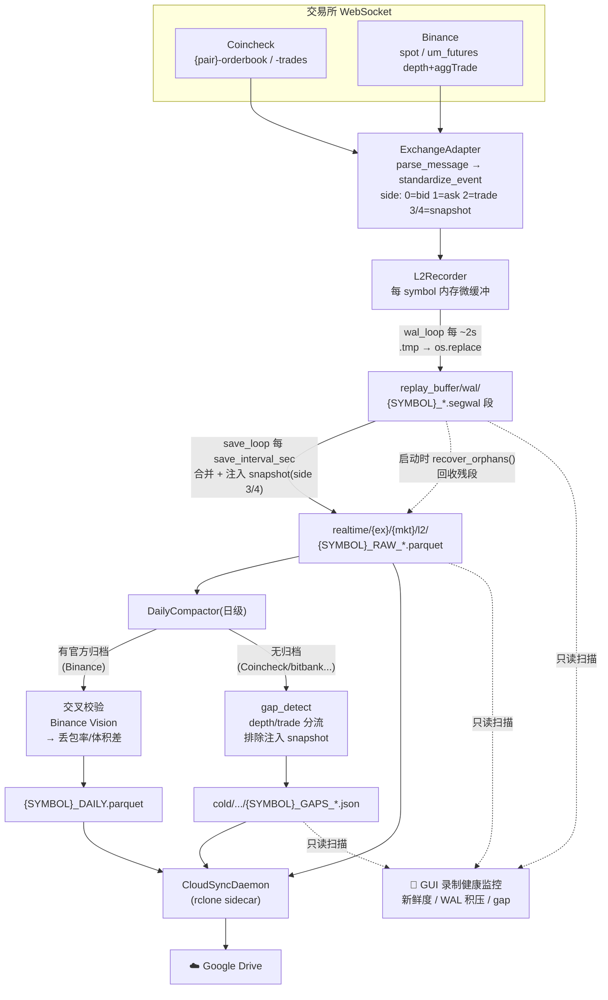
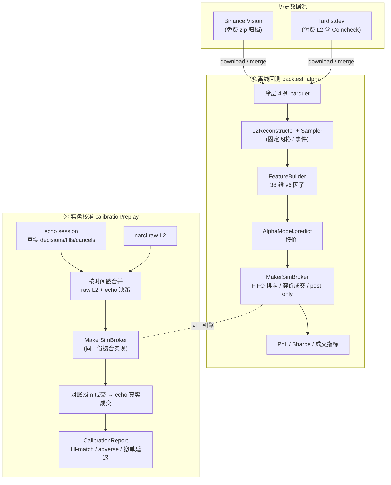

# 💹 Narci Quant Terminal

**Narci** 是一个面向多交易所的量化数据采集、L2 订单簿重构与回测平台。系统专注于 Level 2 (L2) 订单簿的高频采集、毫秒级微观结构重建、崩溃安全落盘,以及事件驱动的撮合回测。

**目标市场:**

| 市场 | 角色 | 说明 |
|---|---|---|
| **Coincheck**(日本现货) | 主交易场 | 主力 JPY 交易对零手续费;无官方 L2 归档,用离线 gap 检测兜底 |
| **Binance 现货**(含 JPY 对) | 次要市场 | 有官方归档(Binance Vision),可交叉校验 |
| **Binance U 本位合约** | 参考 / 对冲 / 信号源 | 无 JPY 对 |

---

## 🌟 核心特性

* **🚀 多币种并发捕获** —— 单 WebSocket 订阅多交易对的深度增量 + 逐笔成交,经交易所适配层(`ExchangeAdapter`)统一为 4 列 schema,交易所细节完全隔离。
* **🛡️ 段式 WAL 崩溃安全落盘** —— 事件先进内存微缓冲,每 ~2s 原子刷成 `.segwal` 段;每个 `save_interval` 合并为自包含的 `_RAW_*.parquet`。硬崩溃丢数据窗口从「一个保存周期」缩到「秒级」,启动时 `recover_orphans()` 回收残段。
* **🧩 微观盘口重建** —— 从增量事件还原毫秒级 Orderbook,计算 Mid / Imbalance / Spread 等 38 维(v6)微观因子;采样时机由 `Sampler`(固定时间网格 / 事件驱动)决定。
* **📐 双重数据保真** —— 有官方归档的 venue(Binance)凌晨自动交叉校验丢包率;无归档的 venue(Coincheck)跑离线 **gap 检测**,depth / trade 分流(可捕捉「盘口死、成交活」的静默故障),产出冷层 `_GAPS_*.json`。
* **⚖️ 一体化撮合引擎** —— 单一 `MakerSimBroker`(FIFO 排队、穿价成交、post-only、现货库存预留、撤单延迟)既是回测撮合器,也是 echo 实盘 broker 的参考实现 —— 从根上消除模拟/实盘不一致。
* **📊 全景 UI 控制台** —— Streamlit + Plotly 强交互看板,含**录制健康监控**(新鲜度 / WAL 积压 / gap)、L2 深度墙、冷数据检索。

---

## 🏗️ 架构(4 层物理分层)

代码按 `core < recorder < analytics` 单向分层(由 `tests/test_layering.py` 强制;`contracts` 与 `core` 同属底层):

| 层 | 目录 | 职责 | 重依赖 |
|---|---|---|---|
| core | `core/` | 共享原语:`io`(parquet / 原子写)、`config`、`symbol_spec` | 无 |
| contracts | `contracts/` | 对 echo/nyx 发布的契约:`schema`(事件 DTO)、`manifest`、`features` | 无 |
| recorder | `recorder/` | 实时采集 + 历史摄取 + 整理:`l2_recorder`、`wal`、`exchange/`、`historical/`、`daily_compactor`、`gap_detect`、`cloud_sync` | pandas/pyarrow/websockets |
| analytics | `analytics/` | `l2_reconstruct`、`sampling`、`features/`、`simulation/`、`calibration/`、`gui/` | +lightgbm/torch/streamlit |

---

## 🔴 录制工作流(Recorder Pipeline)



---

## 🔵 回测 & 校准工作流(Backtest / Calibration)

撮合引擎 `MakerSimBroker` 同时服务两条线:**离线回测**(`backtest_alpha`)与 **实盘校准**(`calibration/replay`,把模拟输出对账 echo 真实成交)。



> **设计要点:** `backtest/` 旧包(`BacktestEngine` 等)已在 P4 整体移除。回测与实盘共用同一个 `MakerSimBroker`,行为由 `tests/simulation/` 锁定 —— 这是「模拟盘/实盘一致」的根本保证。

---

## 🛠️ 安装

```bash
git clone https://github.com/your-repo/narci.git
cd narci
pip install -r requirements.txt
```

重度依赖 `pandas` / `pyarrow` / `websockets`(录制),`lightgbm` / `torch` / `streamlit`(分析)。

---

## 🚀 快速启动

所有核心功能经根目录中枢脚本 `main.py` 触发(子命令:`gui` / `record` / `compact` / `cloud-sync` / `download` / `tardis` / `merge`)。

### 1. 图形化控制台

```bash
python main.py gui          # Streamlit 看板:首屏即「📡 录制健康」
```

### 2. L2 高频录制器(每交易所/市场一进程)

```bash
python main.py record --config configs/coincheck_recorder.yaml   # Coincheck 现货(主交易场)
python main.py record --config configs/spot_recorder.yaml        # Binance 现货
python main.py record --config configs/um_future_recorder.yaml   # Binance U 本位合约
python main.py record --symbol DOGEUSDT                           # 单币种临时覆盖
```

### 3. 历史数据

```bash
python main.py download                                              # Binance Vision 批量
python main.py tardis --symbol ETHUSDT --start 2025-09-01 --end 2026-03-01
python main.py merge  --symbol ETHUSDT --start 2025-09-01 --end 2026-03-01
```

### 4. 归档 + (可选)交叉校验 / gap 检测

```bash
python main.py compact --symbol ETHUSDT      # 碎片 → _DAILY.parquet;按 venue 自动校验或 gap 检测
python main.py compact --symbol ALL
```

### 5. 云同步(与录制解耦)

录制器只负责本地写盘,云同步由独立守护进程负责,经共享 volume 解耦、互不阻塞。

```bash
python main.py cloud-sync --remote gdrive:/narci_raw --interval 300
# Docker 部署推荐用 docker-compose.yaml 的 cloud-sync sidecar
```

### Docker 拓扑

`docker compose up -d` 起 4 个容器:`narci-recorder-{coincheck,spot,umfut}` + `narci-cloud-sync`(rclone sidecar,只读挂载 `narci-data` volume,定时推 GDrive,排除 `wal/**`)。

---

## 📂 目录结构

```text
narci/
├── core/                   # 底层共享:io / config / symbol_spec(无业务依赖)
├── contracts/              # 对 echo/nyx 发布的契约:schema / manifest / features
├── recorder/               # 录制 + 历史摄取 + 整理
│   ├── l2_recorder.py      # 交易所无关录制引擎(细节委托给 adapter)
│   ├── wal.py              # 段式 WAL(崩溃安全落盘)
│   ├── exchange/           # ExchangeAdapter:binance / coincheck
│   ├── historical/         # HistoricalSource:binance_vision / tardis
│   ├── daily_compactor.py  # 日级归档 + 官方校验
│   ├── gap_detect.py       # 无 U/u venue 的离线丢数据检测
│   └── cloud_sync.py       # 独立 rclone 云同步守护
├── analytics/              # 重构 + 因子 + 回测 + 校准 + GUI
│   ├── l2_reconstruct.py   # Orderbook 重建
│   ├── sampling.py         # Sampler:固定时间网格 / 事件驱动
│   ├── features/realtime.py# FeatureBuilder(38 维 v6 在线因子)
│   ├── simulation/         # maker_broker(撮合引擎)+ backtest_alpha
│   ├── calibration/        # replay(对账 echo 真实成交)+ alpha_models
│   └── gui/                # Streamlit 看板 + 录制健康数据层
├── configs/                # 录制器 / broker / 下载器 YAML
├── deploy/                 # 容器入口 / supervisord / healthcheck / reco 运维子项目
├── docs/                   # 设计文档 + 跨模块交接(narci↔reco↔echo↔nyx)
├── scripts/                # ops / research / submit 脚本区(不被 pytest 收集)
├── tests/                  # 分层 lint + 各模块测试(tests/<module>/ 带 README)
└── replay_buffer/          # 数据落盘区(.gitignore 忽略)
    ├── wal/                # {SYMBOL}_*.segwal 段(对所有 *.parquet 扫描器不可见)
    ├── realtime/{ex}/{mkt}/l2/   # _RAW_*.parquet 碎片 + _DAILY 归档
    └── cold/{ex}/{mkt}/    # _DAILY.parquet + _GAPS_*.json
```

---

## 📦 数据格式

4 列 parquet:`timestamp`(ms)、`side`(0-4)、`price`(float)、`quantity`(float,卖方 maker 成交为负)。

side 编码(由 `ExchangeAdapter` ABC 强制):`0`=bid 更新 / `1`=ask 更新 / `2`=aggTrade(负数量=卖方 maker)/ `3`=bid 快照 / `4`=ask 快照。

---

## ⚠️ 重要注意事项

> **关于交叉校验 (L1 校验):** 务必保证 `configs/` 中 `market_type`(spot / um_futures)与预期一致 —— 不同市场交易量天差地别,用合约校验器去校现货数据会报出 **-90%+** 的体积差(跨市场对比错误)。Coincheck 等无官方归档 venue 不走校验,走 gap 检测。

---

## 🔮 愿景

Narci 致力于打造**轻量级、高精度、低门槛**的量化研究基础设施。核心目标:搞钱!
